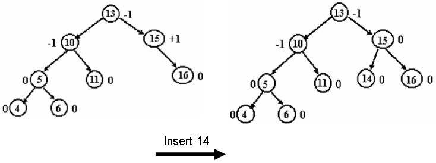
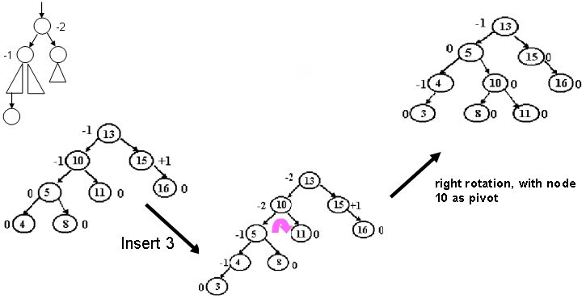
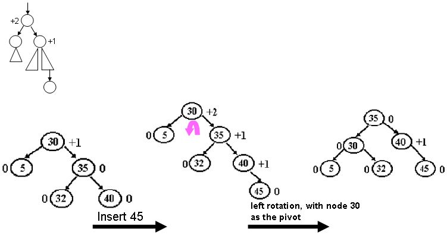
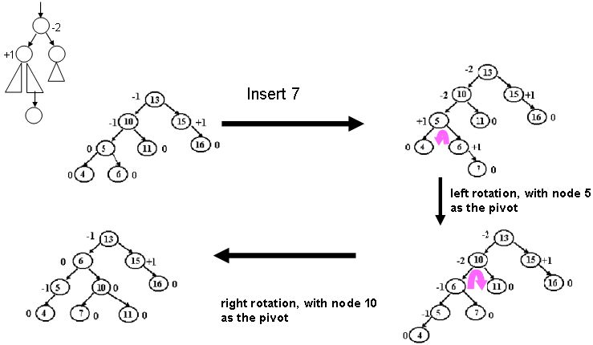
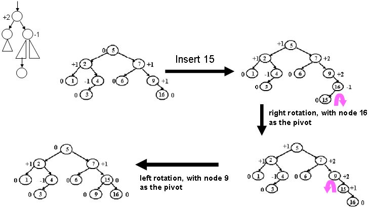
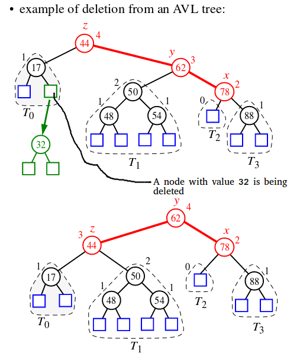

# AVL Tree

AVL tree is a self-balancing Binary Search Tree (BST) where the difference between heights of left and right subtrees cannot be more than one for all nodes.

## Why AVL Trees?
Most of the BST operations (e.g., search, max, min, insert, delete.. etc) take O(h) time where h is the height of the BST. The cost of these operations may become O(n) for a skewed Binary tree. If we make sure that height of the tree remains O(Logn) after every insertion and deletion, then we can guarantee an upper bound of O(Logn) for all these operations. The height of an AVL tree is always O(Logn) where n is the number of nodes in the tree (See this video lecture for proof).

### Insertion Implementation
Following is the implementation for AVL Tree Insertion. The following implementation uses the recursive BST insert to insert a new node. In the recursive BST insert, after insertion, we get pointers to all ancestors one by one in bottom up manner. So we don’t need parent pointer to travel up. The recursive code itself travels up and visits all the ancestors of the newly inserted node.
1) Perform the normal BST insertion.
2) The current node must be one of the ancestors of the newly inserted node. Update the height of the current node.
3) Get the balance factor (left subtree height – right subtree height) of the current node.
4) If balance factor is greater than 1, then the current node is unbalanced and we are either in Left Left case or left Right case. To check whether it is left left case or not, compare the newly inserted key with the key in left subtree root.
5) If balance factor is less than -1, then the current node is unbalanced and we are either in Right Right case or Right Left case. To check whether it is Right Right case or not, compare the newly inserted key with the key in right subtree root.

### Delete Implementation
1) Perform standard BST delete for w.
2) Starting from w, travel up and find the first unbalanced node. Let z be the first unbalanced node, y be the larger height child of z, and x be the larger height child of y. Note that the definitions of x and y are different from insertion here.
3) Re-balance the tree by performing appropriate rotations on the subtree rooted with z. There can be 4 possible cases that needs to be handled as x, y and z can be arranged in 4 ways. Following are the possible 4 arrangements:

a) y is left child of z and x is left child of y (Left Left Case)
b) y is left child of z and x is right child of y (Left Right Case)
c) y is right child of z and x is right child of y (Right Right Case)
d) y is right child of z and x is left child of y (Right Left Case)

