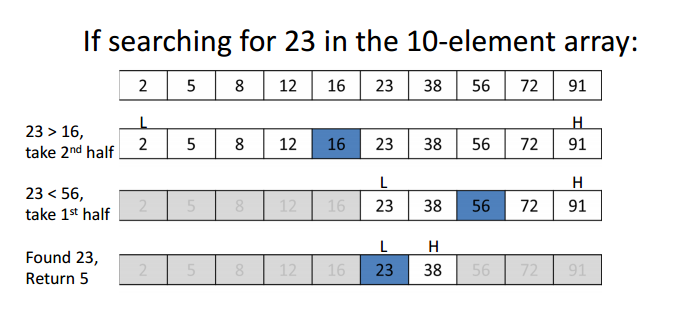

# Binary Search
Search a sorted array by repeatedly dividing the search interval in half. Begin with an interval covering the whole array. If the value of the search key is less than the item in the middle of the interval, narrow the interval to the lower half. Otherwise narrow it to the upper half. Repeatedly check until the value is found or the interval is empty.

We basically ignore half of the elements just after one comparison.

1) Compare x with the middle element.
2) If x matches with middle element, we return the mid index.
3) Else If x is greater than the mid element, then x can only lie in right half subarray after the mid element. So we recur for right half.
4) Else (x is smaller) recur for the left half.

Source:
1) Iterative [BinarySearchIterative.java](./BinarySearchIterative.java)
2) Recursive [BinarySearchRecursive.java](./BinarySearchRecursive.java)

### Time Complexity:
The time complexity of Binary Search can be written as:

`T(n) = T(n/2) + c `