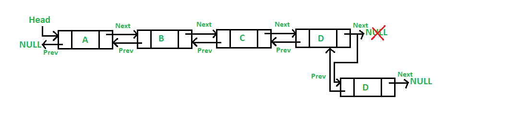

# Doubly Linked List
A Doubly Linked List (DLL) contains an extra pointer, typically called previous pointer, together with next pointer and data which are there in singly linked list.

### Add a node at the front

### Add a node after a given node

### Add a node at the end
