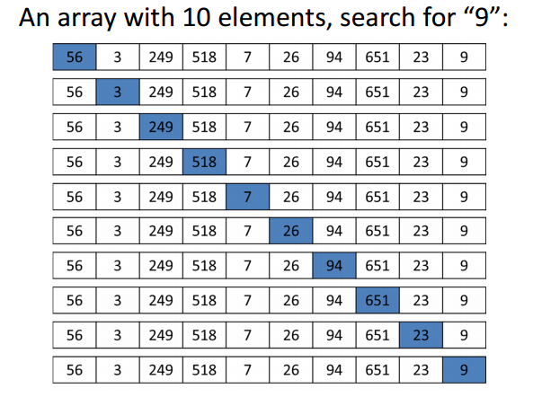

# Linear Search
A simple approach is to do linear search, i.e

1) Start from the leftmost element of arr[] and one by one compare x with each element of arr[]
1) If x matches with an element, return the index.
1) If x does not match with any of elements, return -1.

Source:
[LinearSearch.java](./LinearSearch.java)

