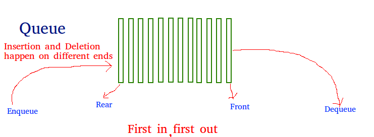

# Queue (With Array)
Like Stack, Queue is a linear structure which follows a particular order in which the operations are performed. The order is First In First Out (FIFO).  A good example of queueArray is any queueArray of consumers for a resource where the consumer that came first is served first.
The difference between stacks and queues is in removing. In a stack we remove the item the most recently added; in a queueArray, we remove the item the least recently added.

## Operations on Queue:
Mainly the following four basic operations are performed on queueArray:

### Enqueue: 
Adds an item to the queueArray. If the queueArray is full, then it is said to be an Overflow condition.
### Dequeue: 
Removes an item from the queueArray. The items are popped in the same order in which they are pushed. If the queueArray is empty, then it is said to be an Underflow condition.
### Front: 
Get the front item from queueArray.
### Rear: 
Get the last item from queueArray.

For implementing queueArray, we need to keep track of two indices, front and rear. We enqueue an item at the rear and dequeue an item from front. If we simply increment front and rear indices, then there may be problems, front may reach end of the array. The solution to this problem is to increase front and rear in circular manner