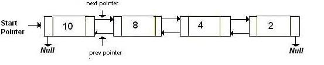

# QuickSort on Doubly Linked List

Considers last element as pivot, places the pivot element at its correct position in sorted array, and places all smaller (smaller than  pivot) to left of pivot and all greater elements to right of pivot

The idea is simple, we first find out pointer to last node. Once we have pointer to last node, we can recursively sort the linked list using pointers to first and last nodes of linked list, similar to the above recursive function where we pass indexes of first and last array elements. The partition function for linked list is also similar to partition for arrays. Instead of returning index of the pivot element, it returns pointer to the pivot element. In the following implementation, quickSort() is just a wrapper function, the main recursive function is linkedListQuickSort() which is similar to quickSort() for array implementation.

Source Code [Source Code](LinkedList.java)

**Time Complexity:** Time complexity of the above implementation is same as time complexity of QuickSort() for arrays. It takes O(n^2) time in worst case and O(nLogn) in average and best cases. The worst case occurs when the linked list is already sorted.

[Referenced](http://www.geeksforgeeks.org/quicksort-on-singly-linked-list/)